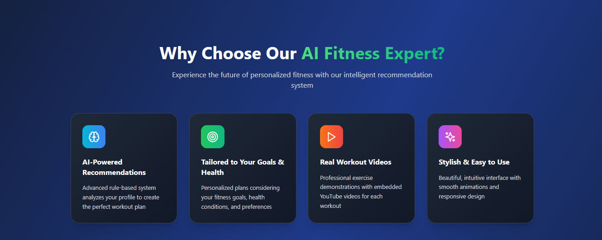
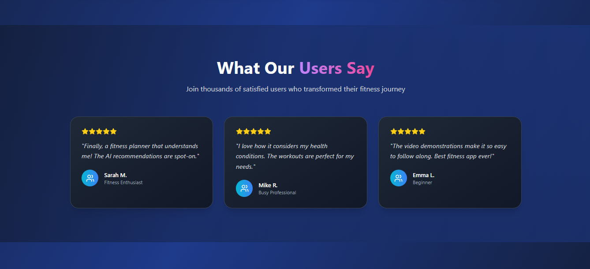
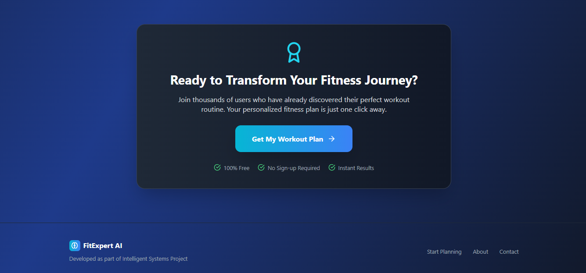
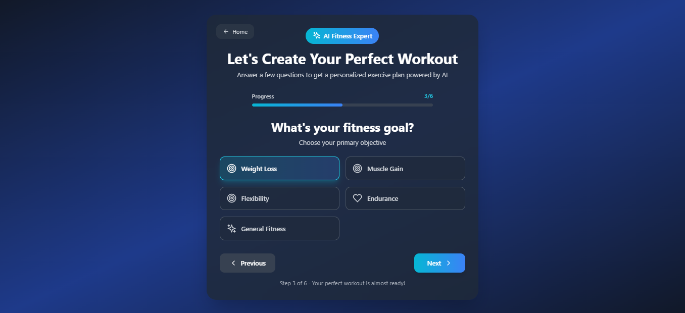
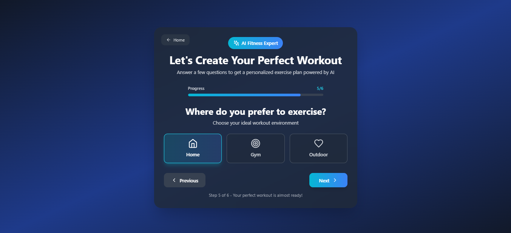
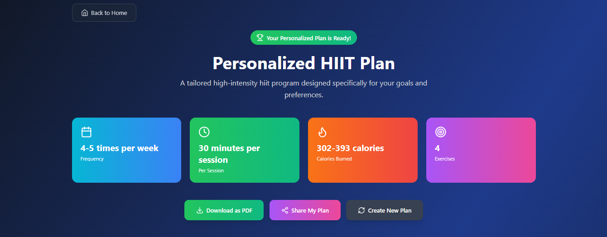
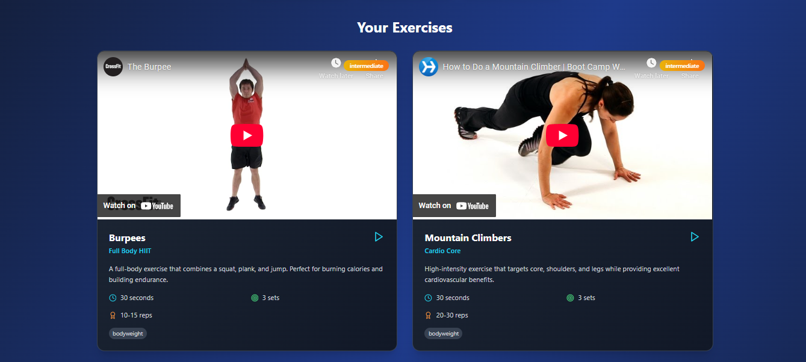
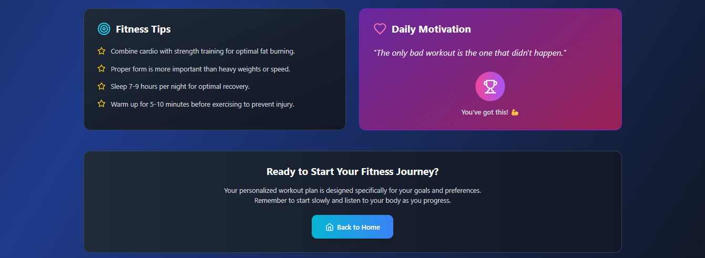

# 🏋️‍♂️ Fitness Expert System

[](LICENSE)
[](https://react.dev/)
[](https://www.typescriptlang.org/)
[](https://tailwindcss.com/)

A modern web-based expert system that helps users plan personalized workout routines and delivers motivational quotes. Built with **React**, **TypeScript**, and **Tailwind CSS**, this project demonstrates a rule-based inference engine for fitness recommendations.

## ✨ Features
- **Personalized Workout Planner:** Input your fitness goals, experience level, and available equipment to receive a tailored workout plan.
- **Exercise Database:** Curated exercises with detailed descriptions and categories.
- **Motivational Quotes:** Inspiring, randomly displayed quotes to keep you motivated.
- **Rule-Based Inference Engine:** Smart recommendations based on user input and expert rules.
- **Modern UI:** Responsive, accessible, and visually appealing interface powered by Tailwind CSS.

## 📁 Project Structure

```text
fitness-expert-system/
├── src/
│   ├── components/    # Reusable React components
│   ├── data/          # Exercise, quotes, and rules data
│   ├── hooks/         # Custom React hooks
│   ├── types/         # TypeScript type definitions
│   └── utils/         # Inference engine and utilities
├── index.html         # Main HTML file
├── package.json       # Project metadata and dependencies
├── tailwind.config.js # Tailwind CSS configuration
├── vite.config.ts     # Vite build configuration
└── ...
```

## 🚀 Getting Started

### Prerequisites
- [Node.js](https://nodejs.org/) (v16 or higher recommended)
- [npm](https://www.npmjs.com/)

### Installation
1. **Clone the repository:**
   ```sh
   git clone https://github.com/your-username/fitness-expert-system.git
   cd fitness-expert-system
   ```
2. **Install dependencies:**
   ```sh
   npm install
   ```
3. **Start the development server:**
   ```sh
   npm run dev
   ```
4. **Open** [http://localhost:5173](http://localhost:5173) in your browser.

## 📝 Usage

1. Fill out the workout form with your preferences.
2. View your personalized workout plan and motivational quote.
3. Adjust your inputs to generate new plans.

## 🛠️ Technologies Used

- [React](https://react.dev/)
- [TypeScript](https://www.typescriptlang.org/)
- [Tailwind CSS](https://tailwindcss.com/)
- [Vite](https://vitejs.dev/)


## 📸 Screenshots

### Homepage
<div align="center">
   
   
   
   
</div>

### Input Forms
<div align="center">
   
   
</div>

### Recommendation
<div align="center">
   
   
   
</div>

## 🤝 Contributing

Contributions are welcome! Please open an issue or submit a pull request for improvements and bug fixes.

1. Fork the repository
2. Create your feature branch (`git checkout -b feature/YourFeature`)
3. Commit your changes (`git commit -m 'Add some feature'`)
4. Push to the branch (`git push origin feature/YourFeature`)
5. Open a pull request

## 📄 License

This project is licensed under the [MIT License](LICENSE).

## 🙏 Acknowledgments

- Inspired by the need for accessible, expert-backed fitness planning tools.
- Thanks to the open-source community for libraries and resources.

## 📬 Contact

For questions, feedback, or collaboration, please contact [chinomsochristian03@gmail.com](mailto:chinomsochristian03@gmail.com).

## 🧑‍💻 Author

**Nduoma Chinomso Christian**  
_AKA Buzz brain_